# ffastdb — Mapa de Clases y Arquitectura Técnica

> **Versión del Motor:** v0.2.7+  
> **Documento de Referencia de Clases:** Explicación exhaustiva del funcionamiento, responsabilidades, interacciones y estado de **todas las clases y componentes** de `ffastdb`.

---

## 🗺️ Mapa General de Arquitectura

```mermaid
graph TD
    UserApp["Aplicación Dart / Flutter"] --> Singleton["ffastdb (FFastDbSingleton)"]
    Singleton --> Core["FastDB (Core Engine)"]
    
    subgraph "FastDB Engine Mixins & Helpers"
        Core --> Crud["_CrudOperations"]
        Core --> QueryOp["_QueryOperations"]
        Core --> BatchOp["_BatchOperations"]
        Core --> IndexMgr["IndexManager"]
        Core --> StorageMgr["_StorageManager"]
    end
    
    subgraph "Query & Optimizer DSL"
        Core --> QB["QueryBuilder"]
        QB --> CBO["Cost-Based Optimizer"]
        QB --> QC["QueryCache (Per Instance)"]
        QB --> Cond["_Condition & Implementaciones"]
    end

    subgraph "Index Engine"
        Core --> PrimaryIdx["BTree (Índice Primario O(log n))"]
        PrimaryIdx --> BNode["BTreeNode (Páginas 4KB)"]
        IndexMgr --> SecIdx["SecondaryIndex (Interfaz)"]
        SecIdx --> HashIdx["HashIndex O(1)"]
        SecIdx --> SortedIdx["SortedIndex O(log n)"]
        SecIdx --> BitmaskIdx["BitmaskIndex (Bitset)"]
        SecIdx --> CompositeIdx["CompositeIndex (Multi-campo)"]
        SecIdx --> FtsIdx["FtsIndex (Full-Text Search)"]
    end

    subgraph "Serialization & Types"
        Core --> Ser["FastSerializer"]
        Core --> Reg["TypeRegistry"]
        Reg --> Adapter["TypeAdapter<T>"]
        Ser --> BinIO["FastBinaryWriter / FastBinaryReader"]
    end

    subgraph "Storage & Memory Layer"
        Core --> PM["PageManager (Caché LRU 4KB)"]
        PM --> LRU["LruCache O(1)"]
        Core --> Strat["StorageStrategy (Interfaz)"]
        Strat --> NativeIO["IoStorageStrategy (RandomAccessFile)"]
        Strat --> WAL["WalStorageStrategy (Crash-Safety)"]
        Strat --> Encrypt["EncryptedStorageStrategy (AES-256-CTR)"]
        Strat --> Buffer["BufferedStorageStrategy"]
        Strat --> WebIDB["IndexedDbStorageStrategy (Web 64KB Chunks)"]
        Strat --> Mem["MemoryStorageStrategy (RAM / Tests)"]
    end
```

---

## 📂 Módulo 1: Punto de Entrada y Núcleo (`lib/src/`)

### 1. `FFastDbSingleton`
* **Ubicación:** [`lib/src/ffastdb_singleton.dart`](file:///c:/Users/gonoj/OneDrive/Documentos/GitHub/fastdb/lib/src/ffastdb_singleton.dart)
* **Descripción:** Punto de acceso global y patrón Singleton estático expuesto mediante la variable de nivel superior `ffastdb` (análogo a `Hive` en Hive).
* **Propiedades Principales:**
  * `_db` (`FastDB?`): Instancia activa de la base de datos subyacente.
  * `isOpen` (`bool`): Indica si la base de datos se ha inicializado correctamente.
  * `db` (`FastDB`): Getter que retorna `_db` o lanza `StateError` si no fue inicializada.
* **Métodos Clave:**
  * `init(String name, {String directory, int version, ...})`: Inicializa y abre la base de datos delegando la estrategia adecuada a `openDatabase()`. Si ya está abierta, retorna la instancia activa.
  * `registerAdapter<T>(TypeAdapter<T> adapter)`: Registra adaptadores de tipo personalizados antes de realizar operaciones I/O.
  * `close()`: Cierra la base de datos y libera la referencia del singleton.
* **Interacción:** Interactúa con `openDatabase` para la resolución multiplataforma (Web / Native) y expone `FastDB`.

---

### 2. `FastDB`
* **Ubicación:** [`lib/src/fastdb.dart`](file:///c:/Users/gonoj/OneDrive/Documentos/GitHub/fastdb/lib/src/fastdb.dart)
* **Descripción:** Clase central del motor de la base de datos NoSQL. Coordina el almacenamiento primario, los índices secundarios, la caché de consultas, las transacciones y las notificaciones reactivas.
* **Propiedades Principales:**
  * `storage` (`StorageStrategy`): Estrategia de almacenamiento principal (ej. cabezal y B-Tree).
  * `dataStorage` (`StorageStrategy?`): Estrategia opcional separada para el archivo de documentos payload (`.dat`).
  * `_primaryIndex` (`BTree`): Índice B-Tree persistente en disco para búsquedas por `id` numérico.
  * `_secondaryIndexes` (`Map<String, SecondaryIndex>`): Registro de índices secundarios en memoria o persistidos.
  * `_queryCache` (`QueryCache`): Caché de resultados LRU asignada por instancia para evitar fugas entre BDs.
  * `_watchers` (`Map<String, StreamController<List<int>>>`): Streams reactivos por nombre de campo.
* **Métodos Clave:**
  * `insert(doc)`, `put(id, doc)`, `findById(id)`, `update(id, changes)`, `delete(id)`: Operaciones CRUD principales (delegadas a `_CrudOperations`).
  * `query()`: Retorna un nuevo `QueryBuilder` inyectando la configuración de la instancia actual.
  * `transaction(fn)`: Ejecuta operaciones en bloque garantizando atomicidad y rollback en caso de excepción.
  * `compact()`: Reorganiza el archivo de datos eliminando registros marcados como eliminados (delegado a `_StorageManager`).
* **Estado / Caveats:** En `_crud_operations.dart`, `deleteImpl` contenía una omisión al no notificar a los watchers (Bug #1 en `BUGS.md`).

---

### 3. `_CrudOperations`
* **Ubicación:** [`lib/src/_crud_operations.dart`](file:///c:/Users/gonoj/OneDrive/Documentos/GitHub/fastdb/lib/src/_crud_operations.dart) (Parte de `fastdb.dart`)
* **Descripción:** Clase de soporte interna para la ejecución detallada de Create, Read, Update y Delete de documentos individuales.
* **Métodos Clave:**
  * `insertImpl(doc)`: Asigna el siguiente ID, serializa el documento mediante `_serialize()`, escribe el byte-array en el offset libre y lo inserta en el B-Tree y en cada índice secundario activo.
  * `putImpl(id, doc)`: Similar a `insertImpl`, pero permite especificar un ID manual (Hive-style).
  * `updateImpl(id, changes)`: Recupera el documento existente, aplica los cambios parciales, actualiza posiciones/índices y notifica streams.
  * `deleteImpl(id)`: Elimina la entrada del B-Tree y remueve las llaves de los índices secundarios.

---

### 4. `_QueryOperations`
* **Ubicación:** [`lib/src/_query_operations.dart`](file:///c:/Users/gonoj/OneDrive/Documentos/GitHub/fastdb/lib/src/_query_operations.dart) (Parte de `fastdb.dart`)
* **Descripción:** Helper interno encargado del pipeline de lectura y carga por lotes de resultados de búsquedas.
* **Métodos Clave:**
  * `findImpl(queryFn)`: Recibe una función de filtrado con `QueryBuilder`, resuelve la lista de IDs y los deserializa.
  * `findByIdsImpl(List<int> ids)`: Optimización de carga masiva de documentos en paralelo usando `Future.wait` por bloques cuando la lista supera los 50 elementos (4x-8x más rápido).

---

### 5. `_BatchOperations`
* **Ubicación:** [`lib/src/_batch_operations.dart`](file:///c:/Users/gonoj/OneDrive/Documentos/GitHub/fastdb/lib/src/_batch_operations.dart) (Parte de `fastdb.dart`)
* **Descripción:** Gestor de inserciones masivas en bloque (`insertAll`) y transacciones atómicas.
* **Métodos Clave:**
  * `insertAllImpl(List<dynamic> docs)`: Procesa listas masivas dividiéndolas en chunks de 5,000 elementos. Activa el modo `writeBehind` en `PageManager` para reducir escrituras en disco y consolida las transacciones WAL.
  * `transactionImpl(fn)`: Activa flags de transacción, inicia un bloque `wal.beginTransaction()` y deshace los cambios en memoria/disco en caso de error.

---

### 6. `IndexManager`
* **Ubicación:** [`lib/src/_index_manager.dart`](file:///c:/Users/gonoj/OneDrive/Documentos/GitHub/fastdb/lib/src/_index_manager.dart) (Parte de `fastdb.dart`)
* **Descripción:** Administra el registro y reconstrucción de índices secundarios en caliente o al arrancar el motor.
* **Métodos Clave:**
  * `addIndex(fieldName)`: Crea un `HashIndex` O(1) para búsquedas de igualdad.
  * `addSortedIndex(fieldName)`: Crea un `SortedIndex` O(log n) para rangos y ordenamiento.
  * `addBitmaskIndex(fieldName)`: Crea un `BitmaskIndex` para campos booleanos o de baja cardinalidad.
  * `addCompositeIndex(fields)`: Crea un `CompositeIndex` para consultas `AND` de múltiples campos.
  * `addFtsIndex(fieldName)`: Crea un `FtsIndex` para búsquedas de texto completo.
  * `reindex([fieldName])`: Realiza un escaneo completo de los documentos activos y vuelve a generar las tablas indexadas.

---

### 7. `_StorageManager`
* **Ubicación:** [`lib/src/_storage_manager.dart`](file:///c:/Users/gonoj/OneDrive/Documentos/GitHub/fastdb/lib/src/_storage_manager.dart) (Parte de `fastdb.dart`)
* **Descripción:** Administrador de persistencia de bajo nivel, salvaguarda de cabezales, serialización de índices y compactación de espacio.
* **Métodos Clave:**
  * `saveHeader()`: Guarda en los primeros 16 bytes la firma mágica `FDB2`, la página raíz del B-Tree, el `nextId` y la versión del esquema.
  * `saveIndexes()`: Serializa el estado de los índices secundarios persistibles en blobs etiquetados por tipo.
  * `compact()`: Copia únicamente los documentos vivos a un nuevo espacio contiguo de almacenamiento y reconstruye las tablas, reduciendo la fragmentación por `delete()`.
  * `applyMigrations(...)`: Ejecuta transformaciones de documentos cuando la versión del esquema en disco es inferior a la especificada en `init()`.

---

## 🔎 Módulo 2: Motor de Consultas y Optimizador (`lib/src/query/`)

### 8. `QueryBuilder`
* **Ubicación:** [`lib/src/query/fast_query.dart`](file:///c:/Users/gonoj/OneDrive/Documentos/GitHub/fastdb/lib/src/query/fast_query.dart)
* **Descripción:** Constructor de consultas con sintaxis fluida y **Cost-Based Optimizer (CBO)** integrado.
* **Propiedades Principales:**
  * `_orGroups` (`List<List<_Condition>>`): Estructura en Forma Normal Disyuntiva (AND dentro de listas internas, OR entre grupos externos).
  * `_queryCache` (`QueryCache`): Referencia a la caché de resultados inyectada por la instancia `FastDB`.
* **Métodos Clave:**
  * `where(fieldName)`: Retorna una instancia de `FieldCondition` para encadenar operadores (`equals`, `between`, `greaterThan`, etc.).
  * `or()`: Crea un nuevo grupo de condiciones disyuntivas.
  * `findIds()`: **Núcleo del CBO**. Ordena las condiciones del grupo por menor cardinalidad estimada (las más selectivas primero) y realiza la intersección de conjuntos de IDs.
  * `explain()`: Genera una representación en texto del plan de ejecución (índices utilizados vs scan).
* **Rendimiento:** El CBO evita escaneos completos al aprovechar índices de menor costo (O(1) Hash/Composite sobre O(log n) Sorted).

---

### 9. `QueryCache`
* **Ubicación:** [`lib/src/query/query_cache.dart`](file:///c:/Users/gonoj/OneDrive/Documentos/GitHub/fastdb/lib/src/query/query_cache.dart)
* **Descripción:** Caché de resultados LRU basada en firma de consulta hash (`String` signature) que almacena la lista inmutable de IDs resultantes.
* **Características:**
  * Retorna copias de lectura cero (`UnmodifiableListView`) para acelerar respuestas repetidas en 10x-100x.
  * Se vacía automáticamente tras cada mutación de datos (`insert`, `update`, `delete`).

---

### 10. `FieldCondition`
* **Ubicación:** [`lib/src/query/fast_query.dart`](file:///c:/Users/gonoj/OneDrive/Documentos/GitHub/fastdb/lib/src/query/fast_query.dart)
* **Descripción:** Clase de intermediación para ofrecer la API fluida `.where('campo').equals(...)`.
* **Métodos Clave:**
  * `equals(val)`, `notEquals(val)`, `between(min, max)`, `greaterThan(val)`, `lessThan(val)`, `contains(str)`, `startsWith(prefix)`, `fts(queryText)`, `isIn(list)`, `isNull()`, `isNotNull()`.

---

### 11. `_Condition` y sus subclases
* **Ubicación:** [`lib/src/query/fast_query.dart`](file:///c:/Users/gonoj/OneDrive/Documentos/GitHub/fastdb/lib/src/query/fast_query.dart)
* **Descripción:** Interfaz abstracta y árbol de tipos concretos de condiciones evaluadas por el motor CBO.
* **Subclases:**
  1. `_EqualsCondition`: Filtrado por coincidencia exacta usando `HashIndex` o `CompositeIndex`.
  2. `_RangeCondition`: Rangos dinámicos utilizando `_RangeMode` (`between`, `greaterThan`, `lessThan`, etc.) sobre `SortedIndex`.
  3. `_ContainsCondition`: Búsqueda de subcadenas o elementos dentro de listas.
  4. `_StartsWithCondition`: Filtrado por prefijo de texto.
  5. `_FtsCondition`: Búsqueda de texto completo multi-token usando `FtsIndex`.
  6. `_InCondition`: Operador `IN` para múltiples valores.
  7. `_IsNullCondition`: Verifica ausencia o valor nulo de un campo.
  8. `_TrueCondition`: Condición comodín para devolver todos los registros cuando no hay filtros.

---

## ⚡ Módulo 3: Motor de Índices (`lib/src/index/`)

### 12. `SecondaryIndex`
* **Ubicación:** [`lib/src/index/secondary_index.dart`](file:///c:/Users/gonoj/OneDrive/Documentos/GitHub/fastdb/lib/src/index/secondary_index.dart)
* **Descripción:** Interfaz abstracta que define el contrato común para todos los índices secundarios.
* **Métodos del Contrato:**
  * `add(value, int docId)`, `remove(value, int docId)`, `clear()`, `get(value)`, `estimateCardinality(value)`.

---

### 13. `BTree` & `BTreeNode` (Índice Primario)
* **Ubicación:** [`lib/src/index/btree.dart`](file:///c:/Users/gonoj/OneDrive/Documentos/GitHub/fastdb/lib/src/index/btree.dart) y [`lib/src/index/btree_node.dart`](file:///c:/Users/gonoj/OneDrive/Documentos/GitHub/fastdb/lib/src/index/btree_node.dart)
* **Descripción:** Implementación de un árbol B-Tree persistente autocontenido y balanceado de grado T=128 (máximo 255 claves por nodo).
* **Características del Nodo (`BTreeNode`):**
  * Serialización/Deserialización directa en páginas fijas de 4096 bytes (`PageManager`).
  * `isLeaf`: `true` si el nodo contiene offsets físicos de datos; `false` si almacena índices de páginas hijas.
* **Complejidad:** Búsqueda, inserción y división de nodos en tiempo **O(log n)** con caché interna de nodos deserializados en memoria.

---

### 14. `HashIndex` & `_HashEntry`
* **Ubicación:** [`lib/src/index/hash_index.dart`](file:///c:/Users/gonoj/OneDrive/Documentos/GitHub/fastdb/lib/src/index/hash_index.dart)
* **Descripción:** Índice secundario basado en tabla de dispersión en memoria para búsquedas de igualdad directa.
* **Rendimiento:** **O(1)** en búsquedas de claves exactas. Incluye soporte de serialización a formato binario binario comprimido para persistencia entre reinicios.

---

### 15. `SortedIndex`
* **Ubicación:** [`lib/src/index/sorted_index.dart`](file:///c:/Users/gonoj/OneDrive/Documentos/GitHub/fastdb/lib/src/index/sorted_index.dart)
* **Descripción:** Índice secundario basado en un `SplayTreeSet` ordenado.
* **Casos de Uso:** Esencial para consultas por rango (`between`, `>`, `<`) y ordenamientos eficientes (`sortBy`).
* **Complejidad:** **O(log n)** para inserciones y búsquedas por rango.

---

### 16. `BitmaskIndex`
* **Ubicación:** [`lib/src/index/bitmask_index.dart`](file:///c:/Users/gonoj/OneDrive/Documentos/GitHub/fastdb/lib/src/index/bitmask_index.dart)
* **Descripción:** Índice de mapa de bits (bitsets) diseñado para campos de baja cardinalidad (ej. banderas booleanas, enums o estados).
* **Rendimiento:** Realiza operaciones lógicas AND/OR ultra rápidas a nivel de CPU con bajísimo consumo de memoria RAM.

---

### 17. `CompositeIndex`
* **Ubicación:** [`lib/src/index/composite_index.dart`](file:///c:/Users/gonoj/OneDrive/Documentos/GitHub/fastdb/lib/src/index/composite_index.dart)
* **Descripción:** Índice compuesto por múltiples campos combinados (ej. `['city', 'status']`).
* **Ventaja:** Permite resolver consultas complejas con múltiples condiciones `AND` en una sola búsqueda O(1), evitando intersectar listas extensas de IDs en memoria.

---

### 18. `FtsIndex`
* **Ubicación:** [`lib/src/index/fts_index.dart`](file:///c:/Users/gonoj/OneDrive/Documentos/GitHub/fastdb/lib/src/index/fts_index.dart)
* **Descripción:** Motor de Búsqueda de Texto Completo (Full-Text Search) mediante índice invertido y tokenización por N-gramas o palabras clave.
* **Optimización Reciente:** Ajustado de O(n×m) a O(n) mediante la conversión de conjuntos con `.toSet()` en intersecciones multi-token.

---

### 19. `IndexStats`
* **Ubicación:** [`lib/src/index/index_stats.dart`](file:///c:/Users/gonoj/OneDrive/Documentos/GitHub/fastdb/lib/src/index/index_stats.dart)
* **Descripción:** Estructura que recopila métricas y estadísticas de uso de los índices (número de entradas, profundidad, memoria estimada y tasa de uso por el CBO).

---

### 20. Concurrencia e Isolates (`ParallelIndexer`, `ExtractedIndexDoc`, `ExtractionTaskPayload`)
* **Ubicación:** [`lib/src/index/parallel_indexer.dart`](file:///c:/Users/gonoj/OneDrive/Documentos/GitHub/fastdb/lib/src/index/parallel_indexer.dart)
* **Descripción:** Utilidades para delegar la extracción y generación pesada de índices secundarios a background Isolates sin congelar el hilo principal de UI en Flutter.

---

## 📦 Módulo 4: Serialización y Sistema de Tipos (`lib/src/serialization/`)

### 21. `TypeAdapter<T>`, `BinaryWriter`, `BinaryReader`
* **Ubicación:** [`lib/src/serialization/type_adapter.dart`](file:///c:/Users/gonoj/OneDrive/Documentos/GitHub/fastdb/lib/src/serialization/type_adapter.dart)
* **Descripción:** Contrato base para la definición de adaptadores binarios personalizados para objetos Dart estilo Hive.
* **Propiedades:** `typeId` debe ser único e inmutable (0-255).

---

### 22. `TypeRegistry`
* **Ubicación:** [`lib/src/serialization/type_registry.dart`](file:///c:/Users/gonoj/OneDrive/Documentos/GitHub/fastdb/lib/src/serialization/type_registry.dart)
* **Descripción:** Registro centralizado de adaptadores. Mapea `typeId` int ↔ `Type` Dart. Evita colisiones de IDs y valida que no se use el ID reservado `256` (`0x0100`).

---

### 23. `FastSerializer`
* **Ubicación:** [`lib/src/serialization/fast_serializer.dart`](file:///c:/Users/gonoj/OneDrive/Documentos/GitHub/fastdb/lib/src/serialization/fast_serializer.dart)
* **Descripción:** Serializador de alta velocidad especializado en documentos JSON y tipos dinámicos de Dart.
* **Soporte Extendido:** Detecta por duck-typing y codifica tipos de Firebase/Firestore (`Timestamp`, `GeoPoint`, `DocumentReference`, `Blob`) y `Uint8List` mediante secuencias de escape nulas (`\u0000dt:`, `\u0000bl:`, etc.) sin acoplar dependencias externas.

---

### 24. `FastBinaryWriter` & `FastBinaryReader`
* **Ubicación:** [`lib/src/serialization/binary_io.dart`](file:///c:/Users/gonoj/OneDrive/Documentos/GitHub/fastdb/lib/src/serialization/binary_io.dart)
* **Descripción:** Implementaciones concretas de lectura y escritura de bytes en formato Little-Endian para tipos primitivos (`int`, `double`, `String`, `bool`, `List`, `Map`). Compatibles con Flutter Web evitando métodos desaprobados en JS.

---

## 💾 Módulo 5: Motor de Almacenamiento e I/O (`lib/src/storage/`)

### 25. `StorageStrategy`
* **Ubicación:** [`lib/src/storage/storage_strategy.dart`](file:///c:/Users/gonoj/OneDrive/Documentos/GitHub/fastdb/lib/src/storage/storage_strategy.dart)
* **Descripción:** Contrato/interfaz abstracta multiplataforma para abstracción de I/O de bytes.
* **Métodos:** `read(offset, size)`, `write(offset, data)`, `flush()`, `truncate(size)`, `readSync()`, `writeSync()`.

---

### 26. `IoStorageStrategy`
* **Ubicación:** [`lib/src/storage/io/io_storage_strategy.dart`](file:///c:/Users/gonoj/OneDrive/Documentos/GitHub/fastdb/lib/src/storage/io/io_storage_strategy.dart)
* **Descripción:** Implementación nativa para Android, iOS, Windows, Linux y macOS basada en `RandomAccessFile` de `dart:io`.

---

### 27. `WalStorageStrategy` & `_WalEntry`
* **Ubicación:** [`lib/src/storage/wal_storage_strategy.dart`](file:///c:/Users/gonoj/OneDrive/Documentos/GitHub/fastdb/lib/src/storage/wal_storage_strategy.dart)
* **Descripción:** Implementación de **Write-Ahead Logging (WAL)** para brindar tolerancia a fallos (Crash-Safety) y transacciones ACID.
* **Funcionamiento:**
  * Toda modificación se escribe primero en el archivo diario de operaciones `.wal` con cabecera mágica `FDBWA` y suma de comprobación `CRC32`.
  * Durante el arranque (`open`), si la última transacción no fue confirmada con un marcador `COMMIT`, se rescatan o descartan las operaciones parciales garantizando la integridad de la BD.

---

### 28. `EncryptedStorageStrategy` & `_Aes256CtrCipher`
* **Ubicación:** [`lib/src/storage/encrypted_storage_strategy.dart`](file:///c:/Users/gonoj/OneDrive/Documentos/GitHub/fastdb/lib/src/storage/encrypted_storage_strategy.dart) y [`lib/src/storage/_aes256_ctr.dart`](file:///c:/Users/gonoj/OneDrive/Documentos/GitHub/fastdb/lib/src/storage/_aes256_ctr.dart)
* **Descripción:** Envoltorio de almacenamiento que descifra y cifra al vuelo mediante **AES-256 en modo CTR** sin dependencias nativas (C/C++).
* **Formato en Disco:** Primeros 12 bytes guardan un Nonce aleatorio seguro; los datos restantes contienen el contenido cifrado por bloques.

---

### 29. `BufferedStorageStrategy`
* **Ubicación:** [`lib/src/storage/buffered_storage_strategy.dart`](file:///c:/Users/gonoj/OneDrive/Documentos/GitHub/fastdb/lib/src/storage/buffered_storage_strategy.dart)
* **Descripción:** Acumula modificaciones escritas en RAM en un búfer circular hasta alcanzar una cuota o invocación explícita de `flush()`, reduciendo la amplificación de escritura en disco.

---

### 30. `IndexedDbStorageStrategy`
* **Ubicación:** [`lib/src/storage/web/indexed_db_strategy.dart`](file:///c:/Users/gonoj/OneDrive/Documentos/GitHub/fastdb/lib/src/storage/web/indexed_db_strategy.dart)
* **Descripción:** Estrategia de almacenamiento persistente en navegadores Web usando `IndexedDB`.
* **Formato:** Divide el espacio de datos en bloques (chunks) de 64 KB cargados perezosamente bajo demanda, manteniendo un uso de RAM controlado.

---

### 31. `WebStorageStrategy` & `LocalStorageStrategy`
* **Ubicación:** [`lib/src/storage/web/web_storage_strategy.dart`](file:///c:/Users/gonoj/OneDrive/Documentos/GitHub/fastdb/lib/src/storage/web/web_storage_strategy.dart) y [`lib/src/storage/web/local_storage_strategy.dart`](file:///c:/Users/gonoj/OneDrive/Documentos/GitHub/fastdb/lib/src/storage/web/local_storage_strategy.dart)
* **Descripción:** Implementaciones Web fallback basadas en `window.localStorage` en codificación Base64 o búferes efímeros.

---

### 32. `MemoryStorageStrategy`
* **Ubicación:** [`lib/src/storage/memory_storage_strategy.dart`](file:///c:/Users/gonoj/OneDrive/Documentos/GitHub/fastdb/lib/src/storage/memory_storage_strategy.dart)
* **Descripción:** Estrategia puramente en RAM mediante `Uint8List` dinámico. Ideal para tests unitarios y cachés volátiles.

---

### 33. `PageManager` y `LruCache` / `_Node`
* **Ubicación:** [`lib/src/storage/page_manager.dart`](file:///c:/Users/gonoj/OneDrive/Documentos/GitHub/fastdb/lib/src/storage/page_manager.dart) y [`lib/src/storage/lru_cache.dart`](file:///c:/Users/gonoj/OneDrive/Documentos/GitHub/fastdb/lib/src/storage/lru_cache.dart)
* **Descripción:**
  * `PageManager`: Organiza el almacenamiento en páginas de tamaño fijo de 4096 bytes (4 KB).
  * `LruCache`: Estructura en lista doblemente enlazada + `HashMap` con operaciones O(1) de inserción/evicción para mantener las páginas activas del B-Tree en memoria.

---

### 34. `OperationLog` & `LoggedOp`
* **Ubicación:** [`lib/src/storage/operation_log.dart`](file:///c:/Users/gonoj/OneDrive/Documentos/GitHub/fastdb/lib/src/storage/operation_log.dart)
* **Descripción:** Registro cronológico de operaciones escritas para auditoría, replicación o reconstrucción.

---

## 🏷️ Módulo 6: Anotaciones y Metadatos (`lib/src/annotations.dart`)

### 35. Clases de Anotación (`FFastDB`, `FFastId`, `FFastField`, `FFastIndex`)
* **Ubicación:** [`lib/src/annotations.dart`](file:///c:/Users/gonoj/OneDrive/Documentos/GitHub/fastdb/lib/src/annotations.dart)
* **Descripción:** Metadatos declarativos para marcar clases modelo de Dart y sus propiedades.
  * `@FFastDB(typeId: n)`: Define una colección/tipo con ID único.
  * `@FFastId()`: Identifica la propiedad entero usada como clave primaria auto-incremental.
  * `@FFastField(slot)`: Asigna una casilla binaria inalterable para permitir evolución segura de esquema.
  * `@FFastIndex(sorted: bool, bitmask: bool)`: Indica al motor que cree índices automáticos al arrancar.

---

## 🌐 Módulo 7: Plataforma, Concurrencia y Utilidades (`lib/src/platform/` & `crc32.dart`)

### 36. `openDatabase()`
* **Ubicación:** [`lib/src/platform/open_database.dart`](file:///c:/Users/gonoj/OneDrive/Documentos/GitHub/fastdb/lib/src/platform/open_database.dart), [`open_database_native.dart`](file:///c:/Users/gonoj/OneDrive/Documentos/GitHub/fastdb/lib/src/platform/open_database_native.dart), [`open_database_web.dart`](file:///c:/Users/gonoj/OneDrive/Documentos/GitHub/fastdb/lib/src/platform/open_database_web.dart)
* **Descripción:** Función de factoría que usa **importación condicional** (`dart.library.js_interop`). Instancia automáticamente `WalStorageStrategy(IoStorageStrategy)` en entornos Desktop/Mobile e `IndexedDbStorageStrategy` en Web.

---

### 37. `IsolateCoordinator` & `SocketProxy`
* **Ubicación:** [`lib/src/platform/isolate_coordinator.dart`](file:///c:/Users/gonoj/OneDrive/Documentos/GitHub/fastdb/lib/src/platform/isolate_coordinator.dart)
* **Descripción:** Coordinador de concurrencia multiaisla. Abre un socket en `loopbackIPv4` para redirigir peticiones de escritura desde Isolates secundarios al Isolate principal poseedor del bloqueo de archivos.

---

### 38. `crc32()` & `_crc32Table`
* **Ubicación:** [`lib/src/crc32.dart`](file:///c:/Users/gonoj/OneDrive/Documentos/GitHub/fastdb/lib/src/crc32.dart)
* **Descripción:** Algoritmo optimizado de suma de comprobación CRC32 (IEEE 802.3, polinomio `0xEDB88320`) mediante una pre-tabla estática de 256 elementos `Uint32List`.
* **Ventaja:** 4x-8x más rápido que la versión de cálculo bit a bit en el hot-path de escrituras WAL y verificación de bloques de datos.

---

## 🔄 Matriz de Resumen y Mapeo de Archivos

| Nombre de la Clase / Componente | Archivo Fuente | Módulo Principál | Responsabilidad Primaria |
| :--- | :--- | :--- | :--- |
| `FFastDbSingleton` (`ffastdb`) | `ffastdb_singleton.dart` | Core | Entry point singleton accesible en la app |
| `FastDB` | `fastdb.dart` | Core | Instancia central y orquestador del motor |
| `_CrudOperations` | `_crud_operations.dart` | Core | Implementación interna de CRUD |
| `_QueryOperations` | `_query_operations.dart` | Core | Pipeline de lecturas y batch loading |
| `_BatchOperations` | `_batch_operations.dart` | Core | Inserciones masivas por bloques y transacciones |
| `IndexManager` | `_index_manager.dart` | Core / Index | Gestión de índices secundarios |
| `_StorageManager` | `_storage_manager.dart` | Core / Storage | Persistencia de cabeceras y compactación |
| `QueryBuilder` | `query/fast_query.dart` | Query DSL | Constructor fluido y optimizador CBO |
| `QueryCache` | `query/query_cache.dart` | Query DSL | Caché LRU de firmas de consulta por instancia |
| `FieldCondition` | `query/fast_query.dart` | Query DSL | DSL de operadores de campo |
| `_Condition` (y derivadas) | `query/fast_query.dart` | Query DSL | Expresiones de filtro AST |
| `SecondaryIndex` | `index/secondary_index.dart` | Index | Contrato abstracto de índice secundario |
| `BTree` / `BTreeNode` | `index/btree.dart` / `btree_node.dart` | Index | Índice primario B-Tree persistente (4KB) |
| `HashIndex` | `index/hash_index.dart` | Index | Búsquedas de igualdad exacta O(1) |
| `SortedIndex` | `index/sorted_index.dart` | Index | Búsquedas por rango y ordenamiento O(log n) |
| `BitmaskIndex` | `index/bitmask_index.dart` | Index | Operaciones ultra rápidas de bits |
| `CompositeIndex` | `index/composite_index.dart` | Index | Consultas multi-campo en O(1) |
| `FtsIndex` | `index/fts_index.dart` | Index | Motor de búsqueda de texto completo |
| `ParallelIndexer` | `index/parallel_indexer.dart` | Index / Concurrencia | Indexación en hilos secundarios (Isolates) |
| `TypeAdapter<T>` | `serialization/type_adapter.dart` | Serialization | Adaptadores binarios de modelos Dart |
| `TypeRegistry` | `serialization/type_registry.dart` | Serialization | Registro indexado por `typeId` |
| `FastSerializer` | `serialization/fast_serializer.dart` | Serialization | Serializador JSON / Binario con parches Firebase |
| `FastBinaryWriter` / `Reader` | `serialization/binary_io.dart` | Serialization | I/O binario de bajo nivel LE |
| `StorageStrategy` | `storage/storage_strategy.dart` | Storage | Contrato de abstracción I/O multiplataforma |
| `IoStorageStrategy` | `storage/io/io_storage_strategy.dart` | Storage | Acceso I/O nativo con RandomAccessFile |
| `WalStorageStrategy` | `storage/wal_storage_strategy.dart` | Storage | Registro previo en diario para Crash-Safety |
| `EncryptedStorageStrategy` | `storage/encrypted_storage_strategy.dart` | Storage | Cifrado transparente AES-256-CTR |
| `BufferedStorageStrategy` | `storage/buffered_storage_strategy.dart` | Storage | Amortiguación de escrituras en RAM |
| `IndexedDbStorageStrategy` | `storage/web/indexed_db_strategy.dart` | Storage | Persistencia Web en bloques de 64KB en IndexedDB |
| `MemoryStorageStrategy` | `storage/memory_storage_strategy.dart` | Storage | Almacenamiento efímero en RAM pura |
| `PageManager` | `storage/page_manager.dart` | Storage | Gestor de bloques de 4KB con caché LRU |
| `LruCache` | `storage/lru_cache.dart` | Storage | Caché de evicción LRU en O(1) |
| `FFastDB`, `@FFastId`, ... | `annotations.dart` | Annotations | Metadatos y directivas para modelos Dart |
| `openDatabase` | `platform/open_database*.dart` | Platform | Factoría con resolución condicional |
| `IsolateCoordinator` | `platform/isolate_coordinator.dart` | Platform | Servidor socket para comunicación entre Isolates |
| `crc32` | `crc32.dart` | Utilities | Cálculo de checksums ultra rápido con tabla 256 |
